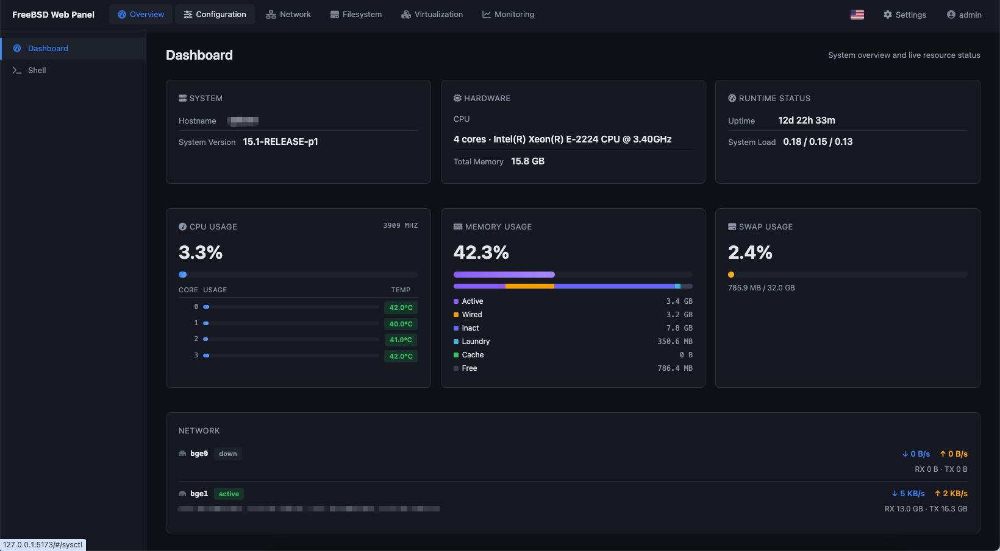

# FreeBSD Web Panel

[English](README.md) | [中文](README.zh-CN.md)

A web-based system administration panel for FreeBSD. Manage sysctl, rc.conf, network, services, SMB file sharing, firewalls, Jails, Bhyve VMs, ZFS, and more from a single self-contained binary with a built-in web UI.

> Target platform: **FreeBSD 15.x amd64**. Runs as root.



## Features

| Module | Capabilities |
|---|---|
| **Dashboard** | Real-time CPU, memory, load, and temperature metrics via sysctl |
| **Monitoring** | Time-series charts (Chart.js) with configurable retention and sampling |
| **Sysctl** | Browse, search, modify runtime values, persist to `sysctl.conf` |
| **rc.conf** | Full CRUD via `sysrc` with categorized descriptions |
| **Crontab** | Manage cron jobs for system users |
| **Services** | List, start, stop, restart rc.d services |
| **Network** | Interface details, routes, default gateway, DNS nameservers |
| **System Accounts** | Browse FreeBSD users and groups |
| **File Manager** | Browse, upload, download, rename, chmod, chown files |
| **SMB File Sharing** | Initialize Samba, manage service state, shares, Samba users, and global configuration |
| **ZFS** | Pool create/import/export/destroy, vdev add/attach/detach/replace, scrub, dataset CRUD, snapshots, rollback, clone |
| **Jails** | Full lifecycle via native libjail FFI — **no third-party jail tools** (jail.conf parser + create/start/stop/delete, base image management) |
| **Bhyve VMs** | Full VM lifecycle via vm-bhyve — create/start/stop/destroy, VNC console, serial console, disks, networks, ISOs, images, switches, datastores |
| **Packages** | Search, install, remove (pkg), package details & file lists, repository management |
| **Web Terminal** | WebSocket-based shell access directly in the browser |
| **Users & Auth** | Built-in user system (Argon2id), session tokens, first-run bootstrap |
| **Audit Log** | All write operations logged (who/when/what/result) |
| **i18n** | Multi-language UI (English, Chinese) with runtime switching |

> SMB file sharing installs `samba416` during its guided initialization. It is an optional third-party dependency, not part of the FreeBSD base system.

## Tech Stack

- **Backend:** Rust 2021 (MSRV 1.74), Axum 0.8, tokio, rusqlite (bundled SQLite), argon2, rust-embed
- **Frontend:** Vue 3 (Composition API) + Vite, Pinia (state), Vue Router (hash), vue-i18n, Chart.js, xterm.js, noVNC. Hand-written dark-theme CSS. Built output is embedded into the binary.
- **Deployment:** Single binary with embedded web assets. TOML config at `/usr/local/etc/fwp.toml`.
- **Jail FFI:** Direct libjail calls (`jailparam_*`) — all `unsafe` isolated in a dedicated `sys` submodule.

## Quick Start

### Prerequisites

- FreeBSD 15.x (amd64)
- Rust toolchain (1.74+)
- Node.js & npm (for frontend build)
- System tools: `sysctl`, `sysrc`, `ifconfig`, `zfs`, `zpool`, `pkg`, `service`, `vm` (vm-bhyve)
- Optional SMB sharing: network access to install `samba416` during panel initialization

### Build

```sh
# Frontend (first time or after frontend changes)
cd frontend && npm install && npm run build   # output → ../web/

# Backend
cargo build --release
```

The release binary with LTO and stripped symbols is output to `target/release/fwp`.

### Run (Development)

```sh
cargo run -- --config fwp.toml
```

With the included `fwp.toml`, the panel listens on `127.0.0.1:8080` and serves web assets from the `web/` directory (live reload on file changes — no rebuild needed for frontend edits).

### First-Run Setup

1. Open `http://127.0.0.1:8080` in your browser.
2. If no users exist, the bootstrap page lets you create the first admin account (no auth required, one-time only).
3. Log in and start managing your system.

## Configuration

The config file is auto-created at `/usr/local/etc/fwp.toml` on first run if it doesn't exist:

```toml
[server]
listen = "127.0.0.1:8080"                  # bind address
web_root = "/usr/local/share/fwp/web"      # disk override for web assets

[paths]
db = "/var/db/fwp/fwp.db"                  # SQLite database
audit = "/var/db/fwp/audit.log"            # audit log

[auth]
session_ttl = 28800                         # session lifetime (seconds)

[monitor]
enabled = true
interval_sec = 30                           # sampling interval
retention_days = 30                         # data retention
```

Override the config path with `--config /path/to/fwp.toml`.

## Production Deployment

### rc.d Service

Install the binary and startup script:

```sh
cp target/release/fwp /usr/local/sbin/fwp
cp rc.d/fwp /usr/local/etc/rc.d/fwp
chmod +x /usr/local/etc/rc.d/fwp
```

Enable and start:

```sh
sysrc fwp_enable=YES
service fwp start
```

### Reverse Proxy

The panel serves plain HTTP. For remote access, put it behind a reverse proxy with TLS (e.g., nginx, Caddy):

```
server {
    listen 443 ssl http2;
    server_name panel.example.com;

    ssl_certificate     /path/to/cert.pem;
    ssl_certificate_key /path/to/key.pem;

    location / {
        proxy_pass http://127.0.0.1:8080;
        proxy_set_header Host $host;
        proxy_set_header X-Real-IP $remote_addr;
    }

    location /api/term/ws {
        proxy_pass http://127.0.0.1:8080;
        proxy_http_version 1.1;
        proxy_set_header Upgrade $http_upgrade;
        proxy_set_header Connection "upgrade";
    }

    location /api/bhyve/vms/ {
        proxy_pass http://127.0.0.1:8080;
        proxy_http_version 1.1;
        proxy_set_header Upgrade $http_upgrade;
        proxy_set_header Connection "upgrade";
    }
}
```

## Project Structure

```
src/
├── main.rs           # CLI entry, config load, server bind
├── app.rs            # Router assembly
├── state.rs          # AppState (shared state)
├── config.rs         # TOML config struct + load/create
├── error.rs          # ApiError → HTTP response mapping
├── db.rs             # SQLite open + helper functions
├── auth.rs           # Argon2 hashing, session tokens, auth middleware
├── audit.rs          # Append-only JSON audit log
├── monitor.rs        # Background metric collector + time-series API
├── jail.rs           # libjail FFI + jail.conf parser
├── bhyve.rs          # vm-bhyve wrapper (VM lifecycle, switches, datastores)
├── cmd.rs            # Typed Command builder + run helper
├── ifutil.rs         # Network interface helpers (getifaddrs, route sysctls)
├── terminal.rs       # WebSocket shell (PTY) + VNC proxy
├── sysinfo.rs        # System info via sysctl
├── web_assets.rs     # rust-embed + disk fallback asset handler
└── handlers/         # HTTP handlers (one file per module)

frontend/             # Vue 3 + Vite frontend source
├── src/
│   ├── main.js       # App entry (Pinia + Router + i18n)
│   ├── App.vue       # Root component
│   ├── assets/       # Dark theme CSS
│   ├── lib/          # API client, formatters, menu config, Chart.js setup
│   ├── i18n/         # vue-i18n init + translations
│   ├── router/       # Vue Router config + auth guard
│   ├── stores/       # Pinia stores (auth, UI dialogs)
│   ├── composables/  # useToast / useConfirm / useAlert / useFormModal
│   ├── components/   # Layout (TopBar, SideBar) + UI (Toast, Dialog)
│   └── pages/        # Feature pages (one .vue per page)
├── public/           # Static assets (img, fontawesome)
└── vite.config.js    # Vite config (outDir=../web)

web/                  # Vite build output (rust-embed target)

docs/
├── plan/             # Design documents (goals & architecture)
└── impl/             # Implementation documents (how it works)
```

## Development

```sh
# Backend check
cargo check

# Frontend build (type-check + bundle)
cd frontend && npm install && npm run build

# Run with dev config (live web assets from repo)
cargo run -- --config fwp.toml
```

The server tries disk `web_root` first, then falls back to embedded assets — so frontend edits are reflected immediately without recompiling.

## Security

- **Listens on localhost by default** — remote access requires explicit config or a reverse proxy.
- **Self-contained auth:** SQLite user table, Argon2id password hashing, SHA-256 session token hashing. No PAM or system users.
- **First-run bootstrap:** When no users exist, `/api/users/bootstrap` creates the initial admin (unauthenticated, once only).
- **Audit trail:** Every write operation is recorded.
- **Runs as root** — required for system administration tasks.

## Documentation

- [Design plans](docs/plan/) — architecture and interface design for each module
- [Implementation documents](docs/impl/) — actual implementation details, data structures, and APIs
- [Roadmap](docs/plan/80-roadmap.md) — phased delivery plan

## License

[MIT](LICENSE) © 2026 Pader