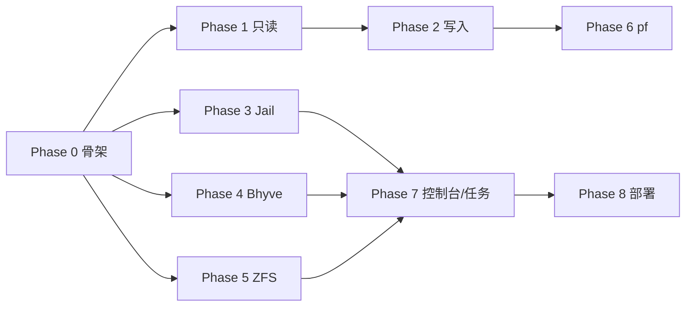

# 实施路线图（分阶段交付）

> 原则：每阶段产出可运行、可验证的增量，而非长期不可用的"大爆炸"。

## 阶段总览

```
Phase 0  项目骨架与基础设施      ── 后端框架、配置、日志、认证、前端骨架
Phase 1  系统配置（只读先行）    ── sysctl / rc.conf / 网络 / 服务查询
Phase 2  系统配置（写入）        ── sysctl / rc.conf / 网络修改 + 持久化
Phase 3  Jail 管理              ── jail.conf 解析 + libjail FFI + 完整 CRUD/生命周期
Phase 4  Bhyve 管理             ── vm-bhyve 封装 + VM 生命周期
Phase 5  ZFS 管理              ── pool/dataset/snapshot 查询与操作
Phase 6  防火墙 pf             ── 状态 + 规则 + 配置编辑
Phase 7  控制台与长任务         ── WebSocket 终端 + 任务队列
Phase 8  打包与部署             ── rc.d 脚本、pkg 集成、文档
```

---

## Phase 0 — 项目骨架与基础设施（MVP 底座）

**目标：可启动的 HTTPS 服务 + 登录页 + Dashboard 空壳。**

### 后端
- `Cargo.toml`、`src/main.rs`（clap 解析配置路径）
- 配置加载 `/usr/local/etc/fwp.toml`（含默认值）
- 日志初始化（`tracing` + 文件 + stderr）
- TLS 自签名证书自动生成
- axum 应用：路由表 + 中间件栈（CORS / 日志 / 认证 / 审计）
- 认证：初始 token 生成 + session token 签发 + 中间件校验
- `/api/auth/login`、`/api/auth/logout`、`/api/system/info`（hostname/uptime/os）

### 前端
- `web/index.html` + Pico.css
- 路由器、API 封装、登录页、布局骨架（侧边栏 + 顶栏）
- Dashboard 占位页

### 验收
- `cargo run` 启动，浏览器访问 `https://localhost:8443`
- 登录页输入初始 token → 进入 Dashboard
- 系统信息 API 返回真实 hostname/uptime

---

## Phase 1 — 系统配置只读

**目标：只读展示 sysctl/rc.conf/网络/服务。**

- sysctl 列表/详情（`sysctl -a` 解析）
- rc.conf 列表（`sysrc -a` 解析）+ 分类描述库
- 网络接口列表（`ifconfig -a` 解析）+ 路由表
- 服务列表（`service -l`/`-e` + status）
- 前端四个只读页面

### 验收
- 各页面正确展示当前系统真实数据，与命令行一致
- 支持搜索/过滤

---

## Phase 2 — 系统配置写入

**目标：可修改 sysctl/rc.conf/网络并持久化。**

- sysctl 运行时设置 + sysctl.conf 持久化
- rc.conf 增删改（sysrc）
- 网络接口 IP/别名修改 + rc.conf 持久化
- 默认网关修改
- 服务 start/stop/restart
- 前端编辑表单 + 确认对话框 + 审计日志

### 验收
- 修改 sysctl 后 `sysctl <name>` 立即生效且写入 sysctl.conf
- rc.conf 改动 `sysrc -a` 可见
- 网络改动 `ifconfig` 可见且重启后保持（rc.conf）
- 服务控制成功
- 所有写操作进审计日志

---

## Phase 3 — Jail 管理（核心差异化模块）

**目标：完整 jail 生命周期管理，libjail FFI，不依赖第三方工具。**

- M1: jail.conf 解析器（AST + 注释保留 + 单元测试，覆盖真实 `/etc/jail.conf`）
- M2: libjail FFI 绑定（`jailparam_*` + `jail_remove` + RAII + 错误映射）
- M3: jail 配置 CRUD API（文件操作）
- M4: jail 运行时控制（list/start/stop/restart，合并 jail.conf 与运行状态）
- M5: 前端 jail 页面（列表 + 编辑抽屉 + 状态徽标）
- M6: jail 控制台（WebSocket + jexec PTY）

### 验收
- 列出当前系统真实 jail（与 `jls` 一致）
- 创建新 jail → 写入 jail.conf → 启动 → `jls` 可见
- 修改运行中 jail 参数（`jail -m` 等价）
- 停止/删除 jail
- 控制台可进入 jail shell
- jail.conf 注释与格式不被破坏

---

## Phase 4 — Bhyve 管理

**目标：通过 vm-bhyve 管理虚拟机。**

- M1: `vm` 命令封装 + `vm list`/`info` 解析
- M2: VM 生命周期 API（start/stop/destroy/restart/install）
- M3: VM 配置编辑（`<name>.conf`）
- M4: 快照/克隆 API
- M5: ISO 管理 + 交换机/数据存储 API
- M6: 前端 VM 页面 + 详情

### 验收
- 列表与 `vm list` 一致（已有 alpine/ubuntu 等 VM 可直接验证）
- 启动/停止 VM 状态同步
- 挂载 ISO 安装 VM
- 快照/克隆成功

---

## Phase 5 — ZFS 管理

**目标：ZFS pool/dataset/snapshot 全功能。**

- M1: `zpool status` 树形解析
- M2: `zfs list`/`get` 解析
- M3: 只读 API（pools/datasets/snapshots）
- M4: dataset CRUD + 属性
- M5: 快照/克隆/回滚
- M6: pool 维护（scrub/attach/replace）+ 任务化
- M7: send/receive（长任务）
- M8: 前端 ZFS 树形视图 + 操作

### 验收
- pool 状态与 `zpool status` 一致（zroot mirror）
- 创建/销毁 dataset（`zfs list` 可见）
- 快照/回滚正确
- scrub 启动 + 进度

---

## Phase 6 — 防火墙 pf

- 状态查询（`pfctl -s info`）
- 规则/NAT/表只读
- 启停 + 重载
- pf.conf 编辑（`pfctl -n -f` 校验）

### 验收
- 状态/规则与 `pfctl` 输出一致
- 编辑 pf.conf 后语法校验通过再保存

---

## Phase 7 — 控制台与长任务统一

- 统一 WebSocket 终端组件（xterm.js）
- jail/VM 控制台接入
- 任务队列框架 + 任务页（ISO 下载、scrub、send/receive 进度）

---

## Phase 8 — 打包与部署

- rc.d 启动脚本 `/usr/local/etc/rc.d/fwp`（`fwp_enable=YES`）
- web 资源嵌入二进制（`--features embed-web`）
- `pkg` 打包（`pkg-plist` + `Makefile` 作为 port）
- README 与部署文档
- 配置文件模板

---

## 优先级与依赖关系



Phase 1–2（系统配置）与 Phase 3–5（三大子系统）在 Phase 0 完成后可**并行开发**，推荐用子任务并行推进。
